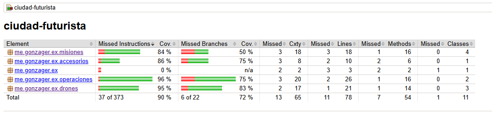
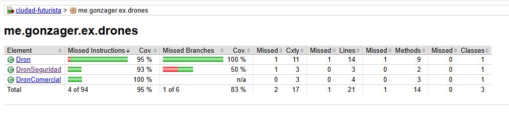
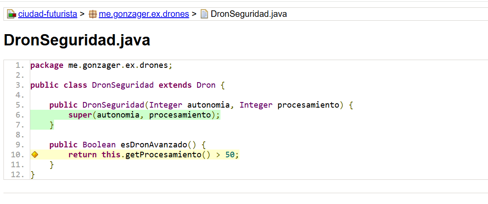
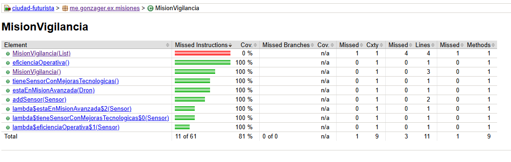
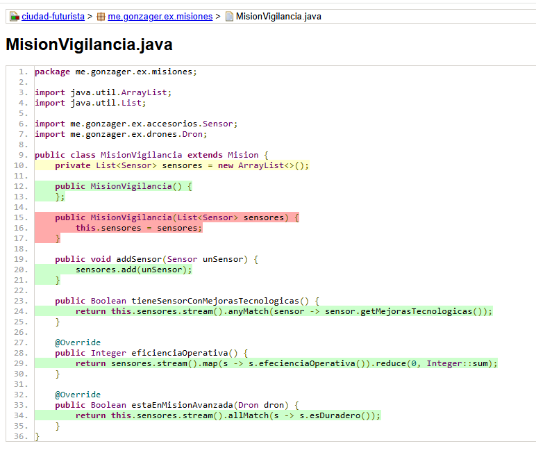

# Repaso Obejtos I :point_up: Prerrequisitos

Vamos a repasar todo lo que aprendimos y para esto vamos a resolver este ejercicio que tomamos en una fecha de Final de Objetos I. Pero lo vamos a resolver en la tecnología que vamos a usar en Obejtos II, sí, **_Java_**!!!

Los ejes principales de este repaso son:

- Polimorfismo
- Herencia
- Colecciones

Por el momento no vamos a hacer enfásis en cuestiones del lenguaje solo vamos a intentar pasar todo el código de la solución en Wollok a Java de la manera más simple posible. Y de paso vamos a ir hablando de algunos patrónes de diseño que usamos en esta solución y de conceptos nuevos que pueden aparecer, como por ejemplo Interfaces.

## Patrones

Como idea de aproximación vamos a mencionar que un patrón de diseño es una solución general y reutilizable para un problema común en el diseño de software. No es un código específico que puedas copiar y pegar, sino una plantilla o guía que describe cómo resolver un problema de diseño de software de manera eficiente y mantenible. Los patrónes utilizado es este ejercicio son:

- Strategy
- Template Method

Segurmante los usaste varias veces en Objetos I, pero ahora llego el momento de formalizar el concepto.

## Enunciado **Ciudad Futurista 🌱**

En una megaciudad altamente tecnificada, diferentes tipos de drones autónomos sobrevuelan las zonas cumpliendo distintas misiones. Los más comunes son los drones comerciales y de seguridad. Sin embargo, también existen otros tipos de drones menos conocidos, y se espera que en el futuro puedan surgir nuevos modelos.

Nuestro objetivo es modelar un sistema capaz de manejar tanto los drones actuales como cualquier tipo de dron que pueda ser añadido en el futuro. De cada dron nos interesa su autonomía, su nivel de procesamiento y su misión dentro de la ciudad.

Actualmente, las misiones disponibles para los drones son: transporte, exploración y vigilancia. Cada dron tiene una misión asignada, pero pueden cambiar de misión si se lo reprograma. Los drones en misión de vigilancia llevan varios sensores. De cada sensor nos interesa conocer su capacidad, su durabilidad, y si cuenta con mejoras tecnológicas y dichos valores nunca cambian luego de que un sensor es creado.

Los drones se agrupan en escuadrones para llevar a cabo operaciones coordinadas sobre una zona. La ciudad futurista define un valor común y configurable (definido inicialmente con el valor 10\) que determina la cantidad máxima de drones que puede tener un escuadrón. De cada zona se conoce su tamaño total y la cantidad de operaciones que ha recibido. Un escuadrón puede operar sobre una zona determinada si lleva al menos 1 dron avanzado y si la capacidad operativa del escuadrón supera al doble tamaño total de la de la zona.

### **Requerimientos:**

1. Obtener la eficiencia operativa de un dron, la cual se calcula como su autonomía multiplicada por 10 más un extra que depende de su misión:
   - Transporte: Obtiene siempre un extra de 100\.
   - Exploración: No recibe ningún extra.
   - Vigilancia: El extra depende de la eficiencia de los sensores que lleve. Si el sensor no tiene mejoras tecnológicas, su eficiencia es igual a su capacidad; si tiene mejoras, este valor se duplica.
2. En el caso de los drones comerciales, debido a su diseño optimizado para largas jornadas, su eficiencia operativa aumenta quince unidades extra.
3. Determinar si un dron es avanzado. Es avanzado si es avanzado según el tipo de dron, o bien es avanzado en su misión asignada.
   - Un dron de seguridad es considerado avanzado si su nivel de procesamiento supera los 50\. Los drones comerciales nunca son avanzados.
   - Un dron es avanzado en su misión dependiendo de la exigencia de la misma:
     - Transporte: Es avanzado si su autonomía supera los 50\.
     - Vigilancia: Es avanzado si todos sus sensores son duraderos. Un sensor es duradero si la durabilidad del sensor en mayor al doble de su capacidad.
     - Exploración: Es avanzado si la eficiencia operativa del dron es un número par.
4. Agregar un dron al escuadrón realizando la comprobaciones correspondientes y en caso de no poder agregarlo lanzar el siguiente error “Supera la cantidad máxima definida por la ciudad”
5. Operar una zona por el escuadrón: Si el escuadrón puede operar la zona entonces sucede lo siguiente
   - la zona registra que recibió una operacion
   - Cada dron que compone el escuadrón disminuye su autonomía en 2 unidades.
6. Realizar la mayor cantidad de test posibles que garanticen el correcto funcionamiento de los puntos anteriores.

## ℹ️ Solución en Wollok

Si queres revisar la solución en Wollok podes entrar al siguiente [Link](https://github.com/unahur-obj2/ciudad_futurista_wollok). Esta solución fue realizada para tomarla como base para la corrección del final.

## :ballot_box_with_check: Como probar el proyecto

Asumiendo que descargaste el proyecto y estas dendro de la carpeta del proyecto que contiene todos los archivos debes ejecutar los comandos que se muestran debajo. La primera vez que ejecutes el primer comando va a descargarde los repositorios de maven las dependencias necesarias para ejecutar el código. Sino sabes que es Maven te recomiendo pasar por este link para comenzar a leer sobre el tema [Maven](https://maven.apache.org/)

```shell
# Instala las dependencias del proyecto y compila el codigo
./mvnw clean install
```

## Test

Ejecutamos los test

```shell
# Corre los test de la apliación
./mvnw clean test
```

Por consola vas a ver el resutlado. Deberías ver algo así:

```Bash
[INFO]
[INFO] -------------------------------------------------------
[INFO]  T E S T S
[INFO] -------------------------------------------------------
[INFO] Running me.gonzager.ex.drones.DronTest
[INFO] Tests run: 12, Failures: 0, Errors: 0, Skipped: 0, Time elapsed: 0.232 s -- in me.gonzager.ex.drones.DronTest
[INFO] Running me.gonzager.ex.misiones.MisionTest
[INFO] Tests run: 2, Failures: 0, Errors: 0, Skipped: 0, Time elapsed: 0.019 s -- in me.gonzager.ex.misiones.MisionTest
[INFO] Running me.gonzager.ex.operaciones.EscuadronTest
[INFO] Tests run: 4, Failures: 0, Errors: 0, Skipped: 0, Time elapsed: 0.023 s -- in me.gonzager.ex.operaciones.EscuadronTest
[INFO]
[INFO] Results:
[INFO]
[INFO] Tests run: 18, Failures: 0, Errors: 0, Skipped: 0
[INFO]
[INFO]
```

## Coverage con JACOCO (Java Code Coverage )

Pero también el proyecto esta configurado con algo interesante que mide el nivel de covertura de las pruebas respecto de todo el código del proyecto. Cuando compilas y corres los test con el comando `/mvnw clean test` se ejecuta el plugin de JACOCO que genera un informe en html con el detalle de la convertura. El archivo index.html lo vas a encontar dentro de la carpeta \target\site\jacoco. Como aclaración, la carpeta target con todo su contiendo tiene el código compilado es decir que se regenera cada vez que compilas o generas los test.

#### Imagenes Ilustrativas

En esta primera imagen vemos en tengo un 72% total de covertura de test.
8383
En el package Drones se muestra que tengo un 83% de convertura. Se aprecia que en la clase DronSeguridad hay ramas de covertura no cubieras. Puede ser, por ejemplo, que los test solo cubrieron un rama de un if.

Los test solo cubrieron un solo valor de resuesta en el coódigo esDronAvanzado()

El Constructor MisionVigilancia(List<Sensor> sensor) no tiene test.

El Constructor MisionVigilancia(List<Sensor> sensor) no tiene test.

